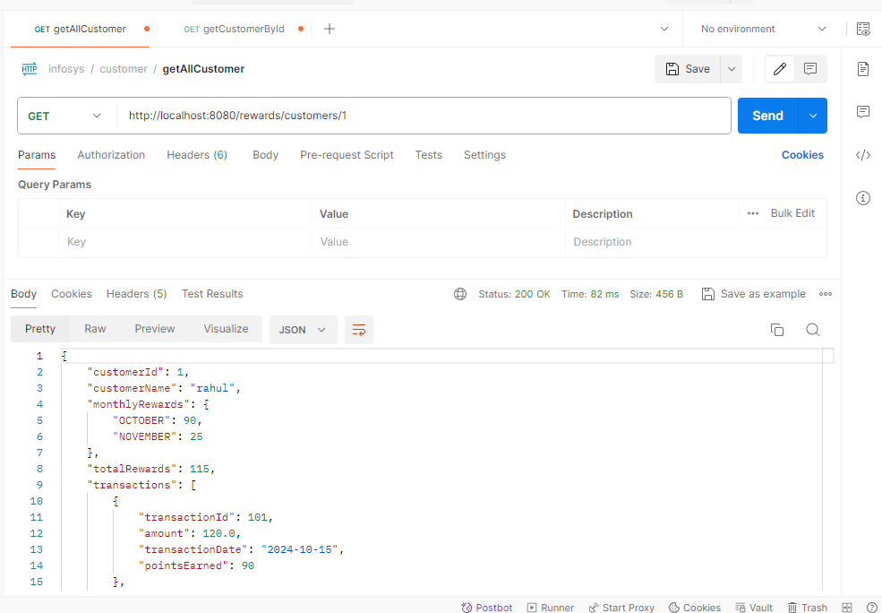
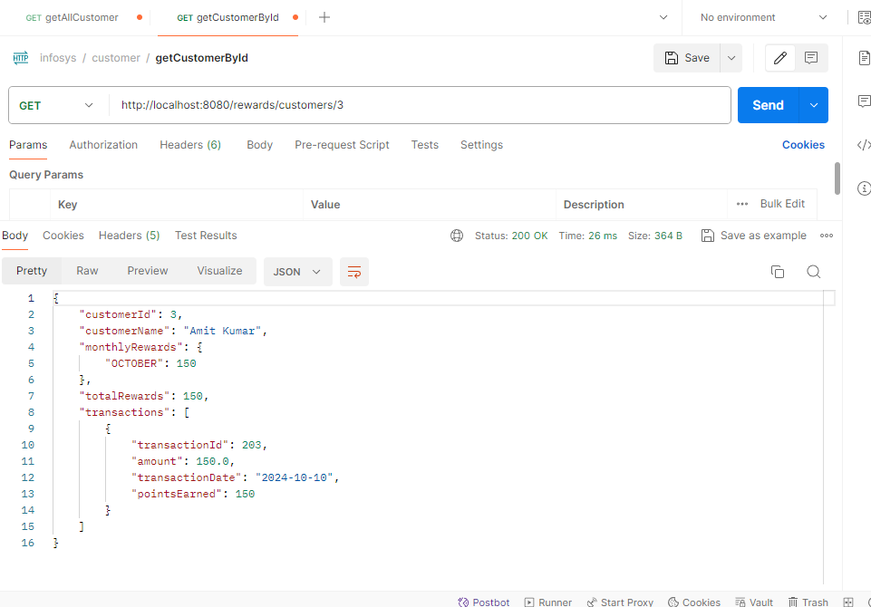
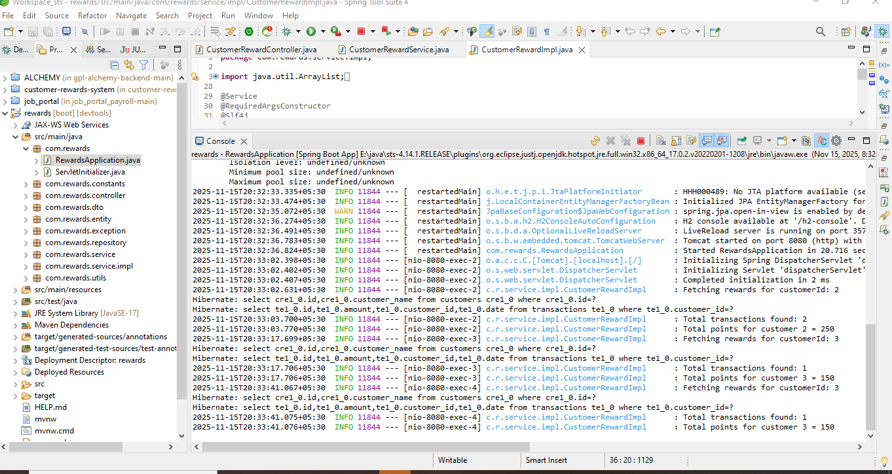

# Customer Rewards System

## ⭐ Project Description

The *Customer Rewards System* is a Spring Boot application that calculates and manages reward points earned by customers based on their monthly transactions. The system provides REST APIs to create customers, record transactions, and fetch detailed reward summaries.

Rewards are calculated using the following rules:

* $0 – $50 → 0 points
* $50 – $100 → 1 point per dollar above $50
* Above $100 → 2 points per dollar above $100 + 50 points for the previous tier

The application uses an *H2 in-memory database* for easy testing and Postman can be used for API testing.

---

## 🧰 Features

* Create, read, update, and delete *Customer* records
* Add, update, delete, and list *Transactions*
* Calculate monthly and total reward points
* Detailed reward summaries including transactions
* Proper exception handling and meaningful API responses
* Layered architecture using DTOs and service layer
* Logging for debugging and monitoring

---

## 📦 Technologies Used

* Java 17+
* Spring Boot
* Spring Web
* Spring Data JPA
* H2 Database
* Lombok
* Postman (for testing APIs)

---

## 🗄 Database Schema

### **CUSTOMERS**

| Column        | Type         | Description          |
| ------------- | ------------ | -------------------- |
| ID            | BIGINT       | Primary key          |
| CUSTOMER_NAME | VARCHAR(255) | customer name        |

### **TRANSACTIONS**

| Column      | Type   | Description                           |
| ----------- | ------ | ------------------------------------- |
| ID          | BIGINT | Primary key                           |
| CUSTOMER_ID | BIGINT | Foreign key referencing CUSTOMERS(ID) |
| AMOUNT      | DOUBLE | Transaction amount                    |
| DATE        | DATE   | Transaction date                      |

*Sample Data*

sql
INSERT INTO CUSTOMERS (ID, CUSTOMER_NAME) VALUES (1, 'Rahul');
INSERT INTO TRANSACTIONS (ID, CUSTOMER_ID, AMOUNT, DATE) VALUES (101, 1, 120.00, '2024-10-15');
`

---

## 🚀 API Endpoints

### Customer APIs

| Method | Endpoint                  | Description             |
| ------ | ------------------------- | ----------------------- |
| POST   | `/rewards/customers`      | Add a new customer      |
| PUT    | `/rewards/customers/{id}` | Update customer details |
| DELETE | `/rewards/customers/{id}` | Delete a customer       |
| GET    | `/rewards/customers/{id}` | Fetch customer rewards  |

### Transaction APIs

| Method | Endpoint                                    | Description           |
| ------ | ------------------------------------------- | --------------------- |
| POST   | `/transaction/transactions`                 | Add a new transaction |
| PUT    | `/transaction/transactions/{id}`            | Update a transaction  |
| DELETE | `/transaction/transactions/{transactionId}` | Delete a transaction  |
| GET    | `/transaction/transactionsList`             | List all transactions |

---

## 🧪 Testing

* Controller Tests : `CustomerRewardControllerTest`, `TransactionControllerTest`
* Service Tests    : `CustomerRewardServiceTest`, `TransactionServiceTest`
* Repository Tests : `CustomerRewardRepositoryTest`, `TransactionRepositoryTest`

All tests use JUnit5, Mockito, and Spring Boot Test with H2 in-memory database.

---

## 🔧 Running the Project

Clone the repository:

git clone https://github.com/bhushan812/reward-calculation-service.git

* Import the project into STS (Spring Tool Suite):

* Open STS

* Go to File → Import → Existing Maven Projects

* Select your cloned project folder

* Click Finish

* Build the project using Maven:

* mvn clean install

##  Run the Spring Boot application:

* Right-click the main class (e.g., CustomerRewardsApplication.java)

* Select Run As → Spring Boot App

4. Access H2 console at: `http://localhost:8080/h2-console`

   * JDBC URL: `jdbc:h2:mem:rewardsdb`
   * Username: `sa`
   * Password: 

5. Test APIs via Postman using the endpoints described above.

---

## 📸 Screenshots

## 📸 Postman – Get All Customers

## 📸 Postman – Get Customer By ID

## 📸 H2 Console

---

